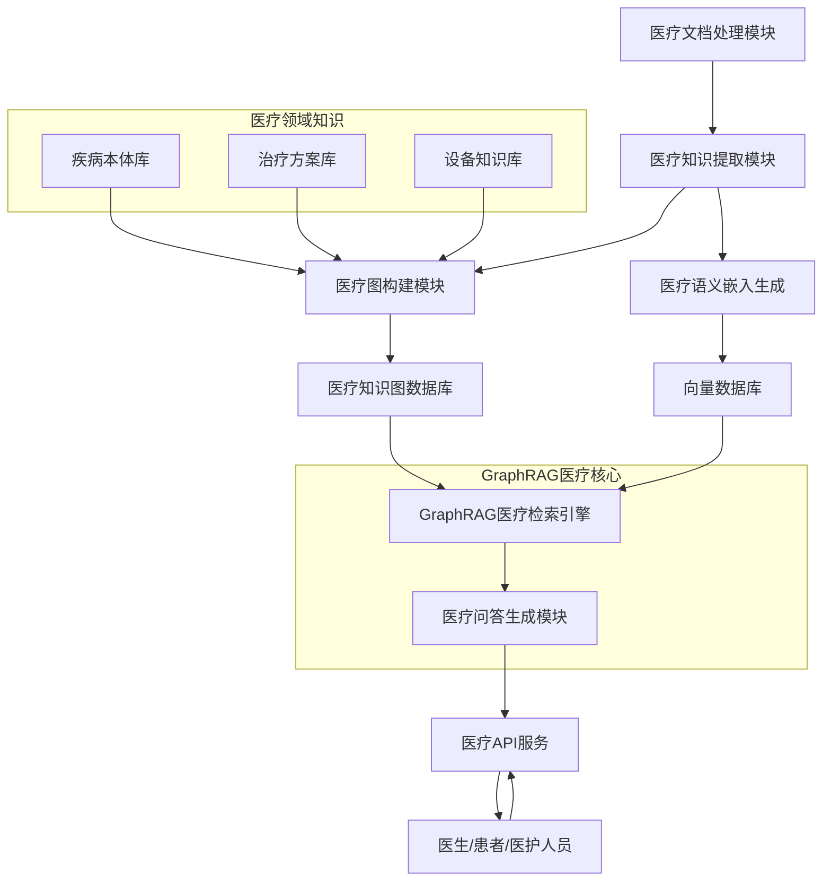

# 设计文档：基于GraphRAG的医疗知识库系统

## 概述

本设计文档描述了一个基于GraphRAG技术的医疗知识库系统。GraphRAG是一种先进的知识检索和生成框架，它结合了知识图谱的结构化表示能力和检索增强生成(RAG)的自然语言处理能力，通过图神经网络增强语义理解和知识推理。

该系统将专门处理呼吸系统疾病相关的医疗文档，包括：
- **三种治疗方案的介绍** - 涵盖不同治疗策略和方法
- **呼吸机使用常见问题AI解答** - 呼吸机操作和故障排除指南
- **成人阻塞性睡眠呼吸暂停低通气综合征无创通气治疗最佳总结** - 专业医学指南

系统将构建围绕呼吸系统疾病、治疗设备、药物治疗和护理指导的综合知识图谱，提供智能问答和临床决策支持。

## 核心领域建模

### 医疗实体类型
- **疾病实体**：阻塞性睡眠呼吸暂停综合征(OSAS)、低通气综合征等
- **治疗方案**：无创通气治疗、CPAP治疗、手术治疗等
- **医疗设备**：呼吸机、面罩、管路系统等
- **症状体征**：打鼾、呼吸暂停、日间嗜睡等
- **诊断指标**：AHI指数、血氧饱和度、睡眠分期等
- **药物治疗**：镇静剂、肌松剂等相关药物
- **护理要点**：设备维护、患者教育、并发症预防等

### 关系类型
- **诊断关系**：症状→疾病、指标→诊断
- **治疗关系**：疾病→治疗方案、设备→治疗效果
- **因果关系**：病因→疾病→后果
- **操作关系**：设备→操作步骤→注意事项
- **适应症关系**：治疗方案→适应患者群体

## 架构

系统采用GraphRAG核心架构，专门针对医疗领域优化：



### 核心组件

1. **医疗文档处理模块**：
   - 支持DOCX/PDF医疗文档解析
   - 保留文档的医学结构（诊断、治疗、用法用量等）
   - 识别医学术语和缩写

2. **医疗知识提取模块**：
   - 基于医学NER的实体识别
   - 医疗关系抽取（诊断、治疗、用药关系等）
   - 临床指南和操作流程提取

3. **医疗图构建模块**：
   - 集成医学本体（ICD-10、SNOMED CT等）
   - 构建疾病-症状-治疗知识图谱
   - 设备操作流程图谱

4. **GraphRAG医疗检索引擎**：
   - 多模态检索（症状查询、设备问题、治疗方案）
   - 基于图结构的临床推理
   - 证据链追踪和引用

5. **医疗问答生成模块**：
   - 临床决策支持
   - 患者教育内容生成
   - 设备故障诊断和解决方案

## 组件与接口

### 1. 医疗文档处理模块

**职责**：
- 解析医疗文档并保持专业结构
- 识别医学术语、药品名、设备型号
- 提取诊疗流程和操作步骤

**接口**：
```python
class MedicalDocumentProcessor:
    def process_medical_document(file_path: str, doc_type: MedicalDocType) -> List[MedicalTextChunk]
    def extract_medical_terminology(text: str) -> List[MedicalTerm]
    def identify_clinical_sections(text: str) -> Dict[str, str]  # 诊断、治疗、用法等
```

### 2. 医疗知识提取模块

**职责**：
- 使用医学NLP模型识别医疗实体
- 抽取疾病-症状-治疗关系
- 提取临床指南和最佳实践

**接口**：
```python
class MedicalKnowledgeExtractor:
    def extract_medical_entities(text: str) -> List[MedicalEntity]
    def extract_clinical_relations(text: str) -> List[ClinicalRelation]
    def extract_treatment_protocols(text: str) -> List[TreatmentProtocol]
    def identify_contraindications(text: str) -> List[Contraindication]
```

### 3. 医疗图构建模块

**职责**：
- 构建疾病-治疗-设备知识图谱
- 集成医学标准本体
- 维护临床决策路径

**接口**：
```python
class MedicalGraphBuilder:
    def build_disease_treatment_graph(entities: List[MedicalEntity]) -> MedicalGraph
    def integrate_medical_ontology(ontology_source: str) -> None
    def create_clinical_pathways(protocols: List[TreatmentProtocol]) -> None
    def update_contraindication_links(contraindications: List[Contraindication]) -> None
```

### 4. GraphRAG医疗检索引擎

**职责**：
- 多维度医疗查询处理（症状、治疗、设备）
- 基于医学推理的结果排序
- 提供临床证据支持

**接口**：
```python
class MedicalGraphRAGEngine:
    def clinical_query_search(query: ClinicalQuery) -> ClinicalSearchResults
    def symptom_to_diagnosis_search(symptoms: List[str]) -> List[DiagnosisCandidate]
    def treatment_recommendation_search(diagnosis: str, patient_profile: PatientProfile) -> List[TreatmentRecommendation]
    def equipment_troubleshooting_search(device: str, issue: str) -> List[TroubleshootingSolution]
```

### 5. 医疗问答生成模块

**职责**：
- 生成临床级别的专业回答
- 提供治疗建议和注意事项
- 生成患者教育内容

**接口**：
```python
class MedicalAnswerGenerator:
    def generate_clinical_answer(query: str, evidence: ClinicalSearchResults) -> ClinicalAnswer
    def generate_patient_education(topic: str, level: EducationLevel) -> PatientEducationContent
    def generate_equipment_guidance(device: str, operation: str) -> OperationGuidance
```

## 数据模型

### 医疗文本块 (MedicalTextChunk)
```json
{
  "id": "chunk_osas_treatment_001",
  "doc_id": "sleep_apnea_guideline",
  "content": "对于中重度OSAS患者，首选无创正压通气治疗...",
  "section_type": "treatment_recommendation",
  "medical_level": "professional",
  "evidence_grade": "A",
  "metadata": {
    "source": "成人阻塞性睡眠呼吸暂停低通气综合征无创通气治疗最佳总结.pdf",
    "page": 15,
    "guideline_version": "2023",
    "authority": "中华医学会呼吸病学分会"
  }
}
```

### 医疗实体 (MedicalEntity)
```json
{
  "id": "entity_osas",
  "type": "Disease",
  "name": "阻塞性睡眠呼吸暂停综合征",
  "aliases": ["OSAS", "OSA", "睡眠呼吸暂停"],
  "icd_10_code": "G47.33",
  "snomed_code": "78275009",
  "properties": {
    "severity_levels": ["轻度", "中度", "重度"],
    "diagnostic_criteria": "AHI≥5次/小时",
    "prevalence": "成人患病率约4-9%"
  },
  "source_chunks": ["chunk_osas_definition_001", "chunk_osas_diagnosis_002"]
}
```

### 临床关系 (ClinicalRelation)
```json
{
  "id": "rel_osas_cpap_treatment",
  "source_entity": "entity_osas",
  "target_entity": "entity_cpap_therapy",
  "type": "FIRST_LINE_TREATMENT",
  "properties": {
    "efficacy_rate": "85-90%",
    "evidence_level": "A",
    "contraindications": ["严重心力衰竭", "颅内压增高"],
    "monitoring_requirements": ["依从性评估", "压力滴定"]
  },
  "source_chunks": ["chunk_cpap_recommendation_001"]
}
```

### 治疗协议 (TreatmentProtocol)
```json
{
  "id": "protocol_cpap_initiation",
  "name": "CPAP治疗启动流程",
  "indication": "中重度OSAS",
  "steps": [
    {
      "step": 1,
      "action": "压力滴定测试",
      "duration": "1-2晚",
      "monitoring": ["AHI改善", "氧饱和度", "睡眠质量"]
    },
    {
      "step": 2,
      "action": "面罩适配",
      "details": "选择合适的面罩类型和尺寸",
      "success_criteria": "无明显漏气，患者舒适度良好"
    }
  ],
  "follow_up": "治疗后1周、1月、3月复查"
}
```

## 技术选择

### GraphRAG核心组件
- **GraphRAG库**：Microsoft GraphRAG
- **图数据库**：Neo4j （支持医学本体集成）
- **向量数据库**：Milvus（支持医学语义向量）

### 医学NLP组件
- **医学实体识别**：BioBERT, ClinicalBERT
- **医学关系抽取**：BioBERT + 医学关系分类器
- **医学文本嵌入**：BioSentVec, ClinicalBERT embeddings

### 医学知识库
- **疾病本体**：ICD-10, SNOMED CT
- **药物知识库**：DrugBank, RxNorm
- **临床指南**：国家卫健委临床路径

### 部署架构
- **后端框架**：FastAPI + GraphRAG
- **文档处理**：Python-docx, PyMuPDF
- **容器化**：Docker + Docker Compose
- **监控**：Prometheus + Grafana + 医疗质量指标

## 安全与合规

### 医疗数据安全
- **数据脱敏**：患者信息匿名化处理
- **访问控制**：基于角色的权限管理（医生、护士、患者）
- **审计日志**：医疗查询和答案生成的完整记录
- **合规性**：符合医疗数据保护法规

### 临床责任
- **免责声明**：明确系统为辅助工具，不替代医生诊断
- **答案标注**：标明证据来源和可信度等级
- **专业审核**：重要临床建议需要医学专家审核

## 质量保证

### 医学准确性
- **专家验证**：邀请呼吸科专家验证知识图谱
- **指南更新**：定期同步最新临床指南
- **多源验证**：交叉验证不同来源的医学信息

### 性能指标
- **准确率**：医学实体识别准确率 > 95%
- **召回率**：相关治疗方案召回率 > 90%
- **响应时间**：复杂临床查询 < 3秒
- **用户满意度**：医护人员使用满意度 > 85%

## 实施路线图

### 第一阶段：基础医疗GraphRAG平台（4周）
- GraphRAG框架搭建
- 医疗文档处理管道
- 基础医学实体识别

### 第二阶段：呼吸系统知识图谱构建（3周）
- 处理三个核心文档
- 构建OSAS治疗知识图谱
- 呼吸机设备知识图谱

### 第三阶段：智能问答系统（3周）
- GraphRAG检索优化
- 医疗问答生成
- 临床决策支持

### 第四阶段：部署与优化（2周）
- 系统部署和监控
- 医学专家评估
- 性能优化和安全加固